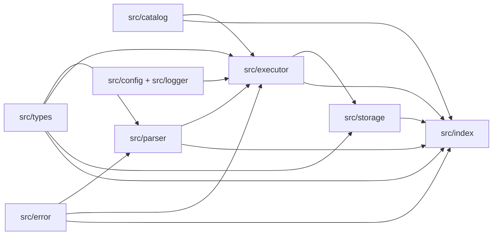

# SQL Engine Module Boundaries

## I-ENG-003

## Module Boundaries
- `src/types`:
  - runtime SQL type model and shared core data contracts.
- `src/error`:
  - unified error enums and constructors for parser/semantic/execution/client layers.
- `src/catalog`:
  - schema metadata helpers and constraint/index cost statistics helpers.
- `src/parser`:
  - SQL grammar surface and AST parsing/export entrypoint.
- `src/executor`:
  - query normalization/semantic evaluation and `WalrusSqlClient` execution API entrypoint.
- `src/storage`:
  - onchain Move-call planning and replay query executor helpers.
- Root entrypoint:
  - `src/index.ts` re-exports all stable module entrypoints above.

## Dependency Graph

